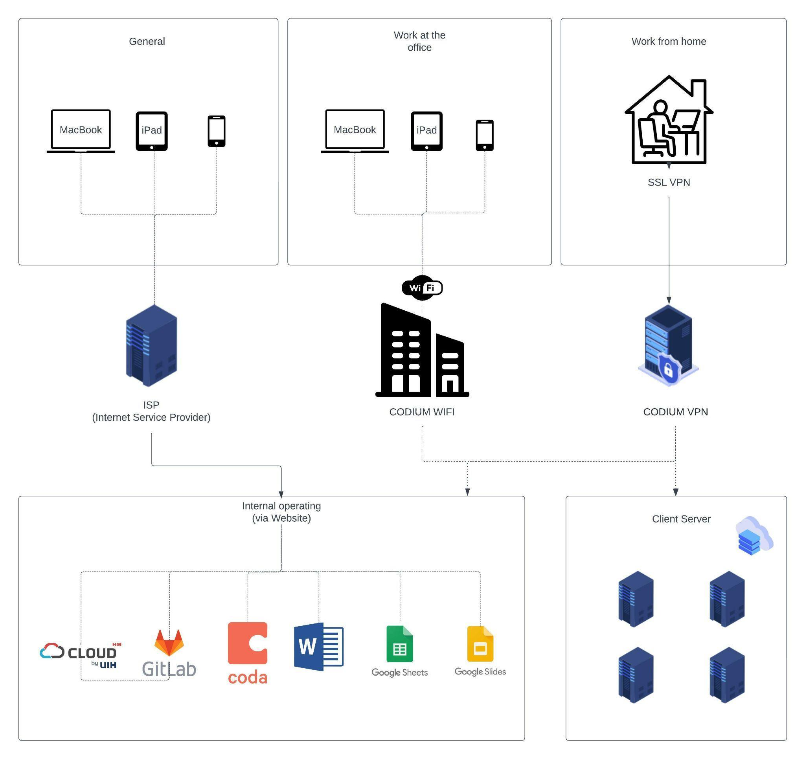

ETRCARSシステム運用手順書
システム名：　車両顧客管理システム「ETRCARS」
文書名：　　　2_手順書開発環境管理手順作成区分
作成日：　　　2025年10月31日
版数：　　　　Ver.1.0
作成者：　　　株式会社エスブランドマネジメント
共同作成：　　CODIUM Co., Ltd.
機密区分：　　関係者限定／外部開示禁止
改変履歴：
本ドキュメントは必要に応じて内容を見直し、最新の運用に合わせて随時更新する
目次

## ネットワーク管理手順

### 目的

Wi-Fi およびファイアウォール管理、VPN 経由の AWS 接続の確認など、CODIUM の内部ネットワークの安全で信頼性の高い運用を確保します。

### 範囲

この手順は、社内インフラストラクチャと AWS 接続を担当する IT 運用チームとネットワークチームに適用されます。ネットワーク/セキュリティ/モバイルデバイス/アプリケーション: これは、ファームウェアの更新があった場合、または外部サービスプロバイダーから通知があった場合に実行されます。

### 手順

#### 内部Wi-Fiアップデート

すべてのワイヤレス アクセス ポイントのファームウェア/ソフトウェア バージョンを四半期ごとに確認します。
サービスの中断を最小限に抑えるために、スケジュールされたメンテナンス期間中に更新を適用します。
SSID 設定とセキュリティ プロトコル (WPA2/WPA3) がセキュリティ標準に準拠していることを確認します。
内部Wi-Fiの年次チェック、アップデート、必要に応じてパッチ適用

#### ファイアウォールの更新

ファイアウォールのパッチレベルとシグネチャの更新を確認します。毎月チェックし、必要に応じてパッチを適用します。
実稼働環境への展開前に、制御された環境で構成の変更をテストします (該当する場合)。
すべての変更と更新を公式の変更ログに記録します。

## 開発PC/iPad管理手順

### 目的

従業員が使用する開発用 PC、ノートパソコン、iPad がセキュリティとコンプライアンスの要件を満たしていることを確認します。

### 範囲

この手順は、CODIUM が所有および管理し、従業員が開発または業務目的で使用するすべてのデバイスに適用されます。

### 手順

#### デバイスの準備

標準構成:
人事部はデバイスをMDMに登録し、MDMのインストールを進めます。
登録すると、デバイスは会社のMDMポリシープロファイルに割り当てられ、自動的に
標準的な企業構成（Wi-Fi、VPN、証明書、制限）
セキュリティポリシー（パスコードルールと自動ロック）
必要なアプリ
MDM をサポートしていないデバイスの手動構成:
iPadOS 12 などの MDM をサポートしていないデバイスの場合、例外が資産登録に記録されます。
強力なパスコード、デバイスの制限、自動ロック設定、企業基準に合わせたアプリケーションのインストール制限など、手動のセキュリティ構成が適用されます。

#### 従業員へのデバイスの割り当て

従業員記録の適切な登録とすべての雇用詳細が正式に記録されたことの確認を含む採用プロセスが完了した後、人事部は割り当てられたデバイスを従業員に引き渡すものとする。
HRは資産台帳にデバイスの割り当てを記録します。
従業員がデバイス使用契約に署名する

#### 継続的なデバイスの監視とメンテナンス

デバイス監視
MDM ダッシュボードを通じて、登録されているすべてのデバイスのコンプライアンスを監視します。
デバイスが会社のポリシー（OS アップデート、アプリのコンプライアンス）に準拠していることを保証します
MDM以外のデバイスについては、IT部門が四半期ごとにコンプライアンスチェックを実施します。
メンテナンス
オペレーティングシステム（OS）とモバイルデバイス管理（MDM）のパッチを適用する
MDM レポートとログ結果を通じてパッチのコンプライアンスを確認する

#### デバイスの返却（オフボーディング）

人事部は退職手続き中にデバイスを回収します
デバイスのワイプとMDMからの登録解除に進みます（または、MDM非対応デバイスの場合は工場出荷時設定へのリセットを実行します）。
デバイスは、MDM に再登録して再構成されます (MDM 以外の場合は手動でセットアップします)
HRは資産台帳を更新し、デバイスを利用可能としてマークします
デバイスを再割り当てするには、「従業員へのデバイスの割り当て（セクター2）」に従って進めてください。

#### 紛失したデバイスの取り扱い

従業員は、デバイスを紛失または盗難された場合、直ちに人事部に通知する必要があります（紛失の通知後 1 時間以内に）。
HRは以下の行動を取る
MDMデバイスの場合は、MDMを使用してデバイスをリモートでロックおよびワイプし、機密データを保護します。
MDM 非対応デバイスの場合:
Apple ID / iPadを探すまたは同等のツールを使用して検索を試みます。
セキュリティリスクを経営陣に通知します。
HRは資産登録を更新し、デバイスのステータスを「紛失/消去済み」として反映し、実行されたアクションを含むインシデントの詳細を記録します。
デバイスが回復不能な場合は、人事部門とIT部門が交換プロセスを調整します。

#### 安全なデータ消去

すべてのデバイスは、再利用、廃棄、または廃棄する前に安全に消去する必要があります。
方法:
MDM 登録デバイスの場合:
MDM 経由で発行されたリモート ワイプ コマンド。
完了を確認し、結果をログに記録します。
MDM 非対応デバイスの場合:
工場出荷時設定にリセットし、Apple ID/iCloud がサインアウトされていることを確認します。
完了を確認し、結果をログに記録します。
例外処理
標準的な方法で安全に消去できないデバイスは、物理的に破壊するか、追加の安全対策を講じるために経営陣にエスカレーションする必要があります。
HRは、デバイスの状態と安全なデータ消去ログを反映するために資産登録を更新します。

#### コンプライアンス

モバイル デバイス管理 (MDM) ダッシュボードを定期的に監視して、すべてのデバイスが会社のポリシーと構成に準拠していることを確認します。
四半期ごとに資産台帳のレビューを実施する
インシデント発生後（デバイスの紛失や破損など）などの緊急の場合、または経営陣からの要請に応じて、毎月資産台帳のレビューを実施します。

#### ハードウェア棚卸し

開発に使用するPCおよびiPadは四半期に１度、または、従業員の入れ替え、退職時に、別紙E4_ハードウエア管理台帳で棚卸しを実施する

#### PCログインIDの棚卸し（MDM監視）

・ハードウェアの棚卸しと同時期に、本人以外のIDが使用されていないことを確認する。

## ソースコード管理手順

### 目的

ソースコード リポジトリを管理および保護し、開発活動がセキュリティと品質のベスト プラクティスに従っていることを確認します。

### 範囲

この手順は、CODIUM 内で GitLab リポジトリを使用するすべての開発者とチームに適用されます。

### 手順

#### リポジトリ構造とアクセス制御

リポジトリ組織:
各プロジェクトには専用のリポジトリが必要です。
すべてのソースコードは、指定された GitLab グループ/プロジェクトに登録する必要があります。
メイン ブランチへの直接コミットは固く禁止されています。
アクセス制御:
リポジトリにアクセスできるのは許可された担当者のみです。
アクセス割り当てプロセス
マネージャーはアクセス要求を送信し、
プロジェクト/リポジトリ名
必要な役割
リポジトリ管理者がリクエストを確認し承認する
リポジトリ管理者がアクセスを許可する
組織を退職する従業員や契約を終了する従業員のアクセスは、終了時に削除されます。

#### コードレビューと承認プロセス

従業員は、AWS 運用ドキュメントの GitLab セクションにあるコード管理およびマージ手順に記載されている手順に従う必要があります。

#### バックアップと災害復旧

リポジトリはホスティング プラットフォームによって自動的にバックアップされる必要があります。
リポジトリが破損したりデータが失われたりした場合は、最新のバックアップを復元する必要があります。

#### コンプライアンスと監査

リポジトリ アクセス、コミット履歴、プル リクエストはいつでも監査可能です。
定期的な監査では以下の点を検証する必要があります。
適切なブランチとマージポリシー
品質とトレーサビリティの確保
役割の割り当てに合わせたアクセス権限