EC2パッチメンテナンス手順

ステップ1
パッチ適用
1. CODIUM PCを使用してCODIUM IPに接続します
2. AWS開発者IAMアカウントにログイン
3. AWS System Manager -> Patch Manager
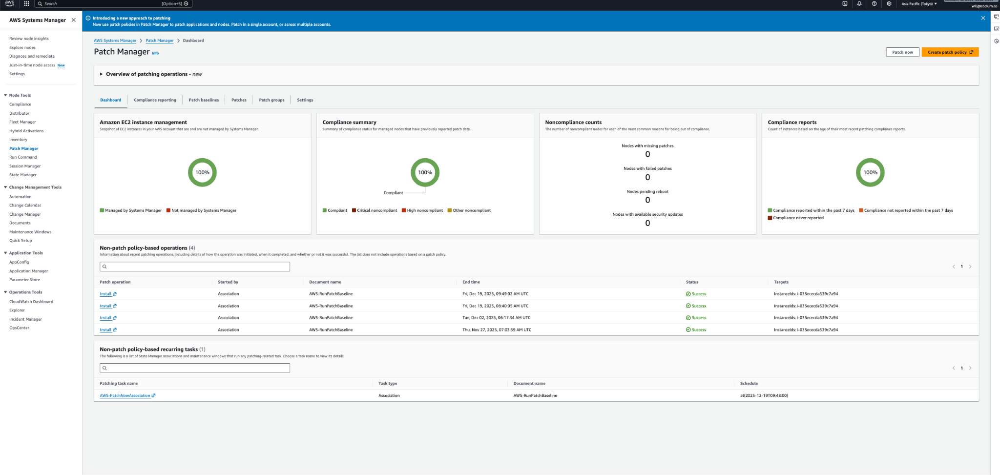
4. 「今すぐパッチ」をクリック
5. 「構成」→「スキャンとインストール」を選択
6. Bastion インスタンスを選択する
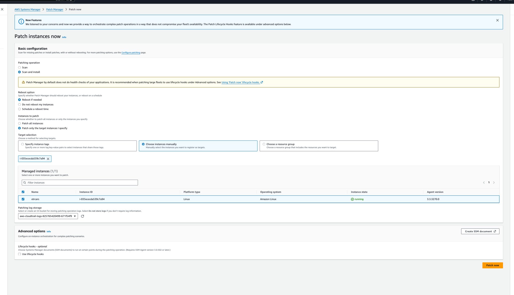
7. パッチ適用プロセスが完了するまで待ちます
ステップ2
検証
1.AWS System Manager -> Patch Managerダッシュボード
2.非パッチポリシーベースの運用では、成功を示す
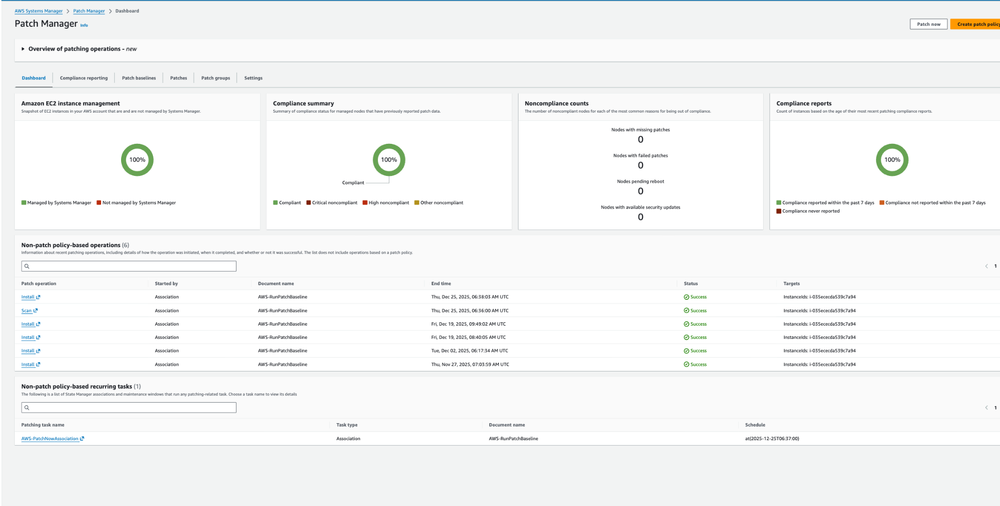
3. パッチの詳細は、 AWS System Manager -> コマンド実行 -> コマンド履歴で確認できます。
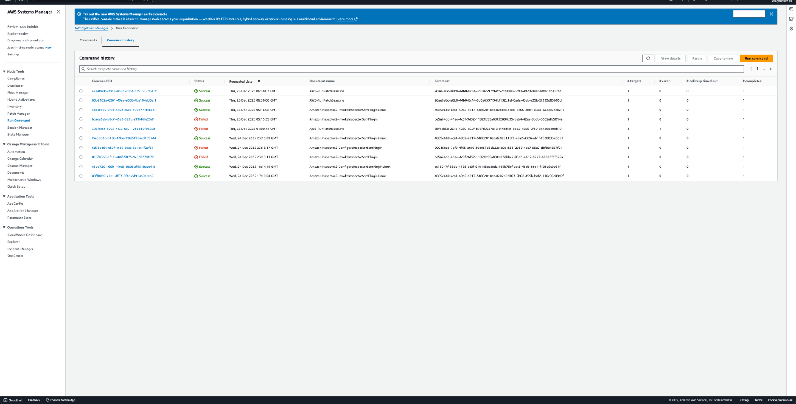
4. 失敗した場合は、コマンドの詳細とエラーメッセージを確認し、EC2 インスタンスを再起動して、同じ手順で再度パッチを適用します。
ステップ3
チェック中
1. ステップ2が完了したら、EC2インスタンスのステータスを確認します。
2. EC2 -> インスタンス -> 要塞インスタンスを選択
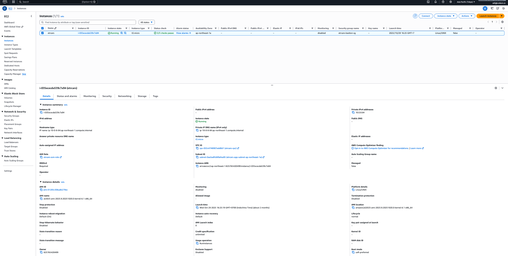
3. ステータスとアラームタブで、システムが実行中であり、ステータスチェックに合格していることを確認します。
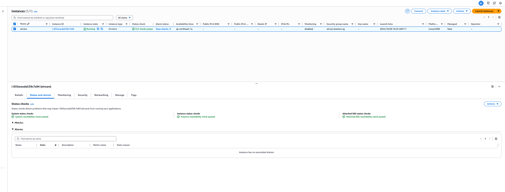
4. 監視タブでCPU負荷が過負荷になっていないか確認します
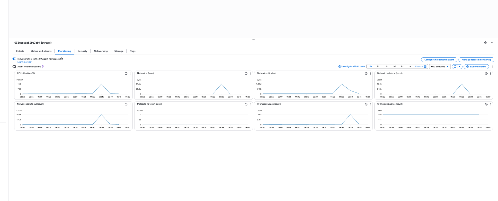

5. 上記の点が満たされていない場合は、手順を停止し、原因を調査し、必要に応じてインスタンスを再起動します。
ステップ4
接続テスト
1. CODIUM IPの下でCODIUM PCを使用します。
2. AWS開発者IAMアカウントにログインする
3. AWSセッションマネージャーを使用した接続テスト
4. AWS System Manager -> セッションマネージャー -> セッションの開始に移動します。
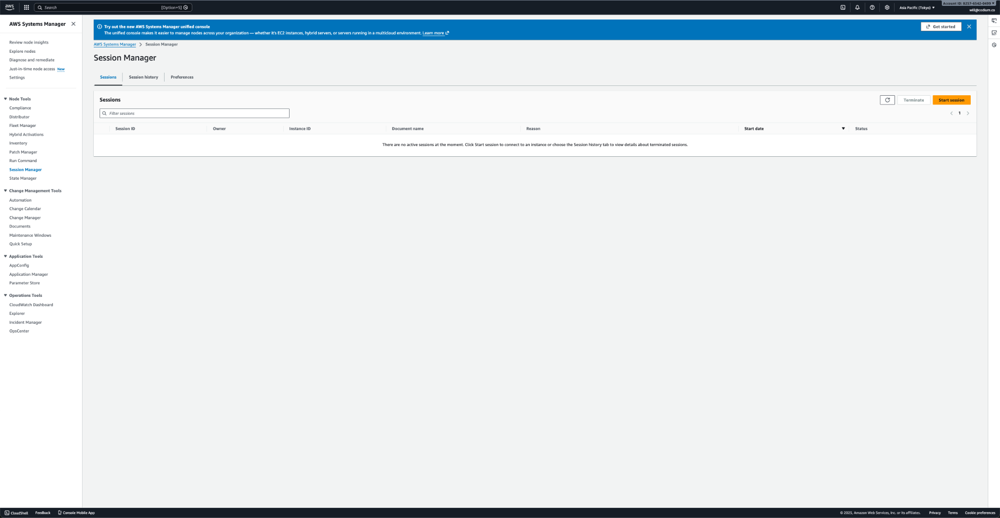
5. etrcars bastionインスタンスを選択し、セッションを開始します。
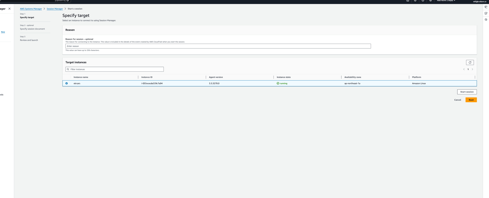
6. 要塞インスタンスへのSSHセッションが正常に接続されます。
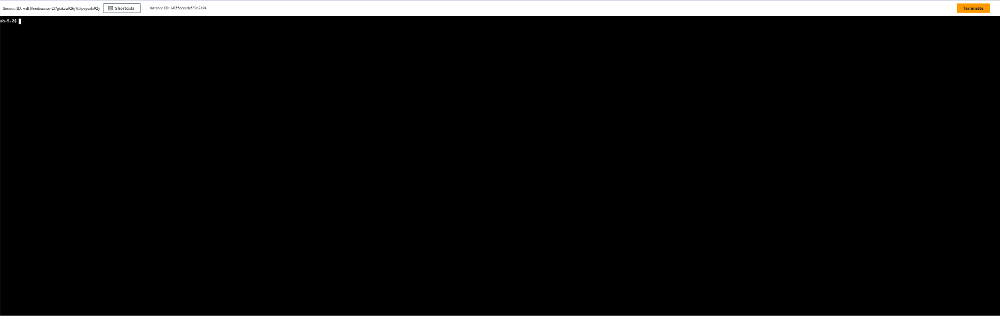
7. /var/logのOSログをチェックして、すべてが正常であることを確認します。
8. 上記の手順が満たされていない場合は、接続失敗の原因を調査してください。必要に応じてインスタンスを再起動してください。要塞インスタンスのVPC、セキュリティグループ、サブネットなどのネットワーク構成を確認し、修正してください。
ステップ5
データベースへの接続テスト
1. CODIUM IP の下で CODIUM データベース PC を使用します。
2. 接続するには日本チームの開発者であり、日本側からのMFAが必要です。
3. データベース接続コマンドを使用してデータベースに接続します。

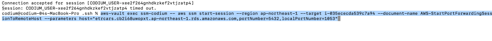
4. LINEグループからエスブランドへのMFAアクセスをリクエストします。
5. 手順 3 で要求された AWS アクセスポータルに MFA を入力します。
 

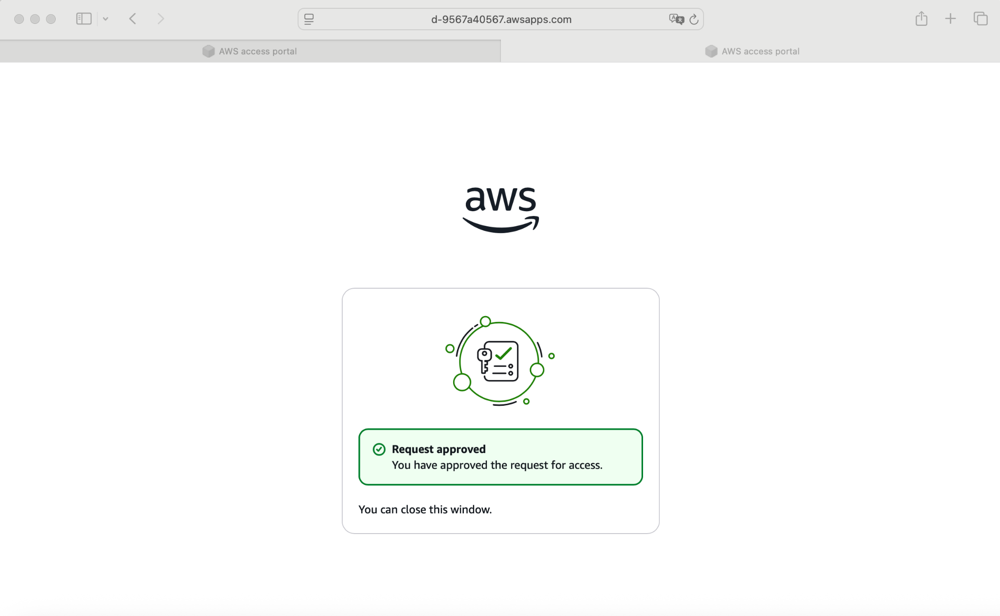
6. Datagripを開き、ポート1053、ホスト127.0.0.1を使用してデータベースに接続します。
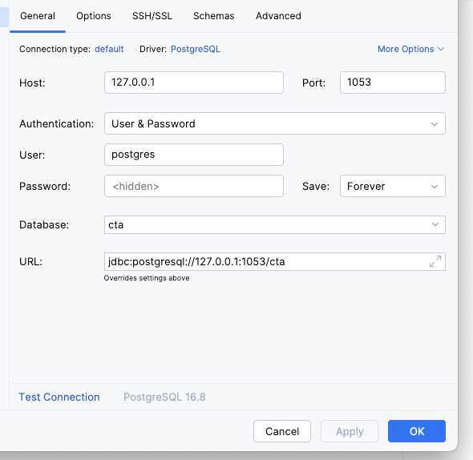
7. データベース接続が正常に接続されます。
8. 上記の手順が満たされていない場合は、原因を調査してください。必要に応じてMFAを再試行し、EC2インスタンスのステータスを確認してください。