ECSパッチメンテナンス手順

ステップ1
パッチ適用
1. CODIUM PCを使用して任意のコードエディタを使用する
2. AWS開発者IAMアカウントにログイン
3. AWS Inspector -> 結果 -> コンテナイメージ別
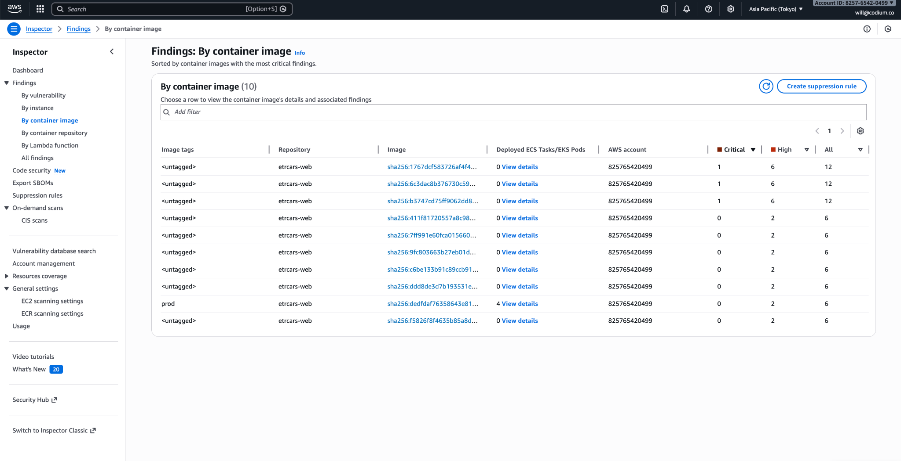
4. 画像タブ製品を選択
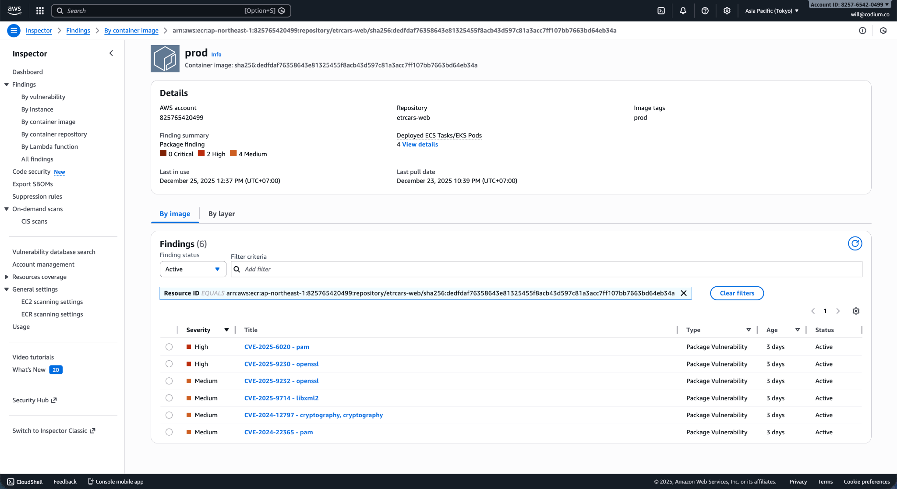
5. 利用可能な脆弱性を確認する
6. コードエディターで -> requirements.txt
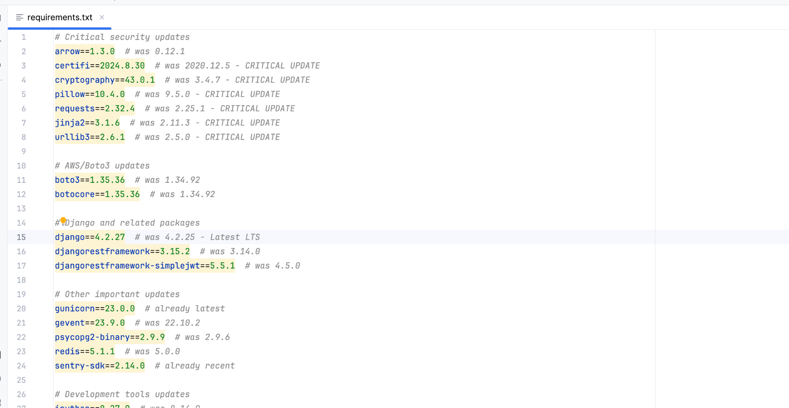
7. 脆弱性の影響を受けるライブラリのバージョンを更新する
8. 開発環境にデプロイ -> テスト -> 日本側で承認を依頼 -> 本番環境にデプロイ
ステップ2
検証
1. メンテナ権限を持つ開発者が適用したパッチを本番環境に展開する
2. CODIUMアカウントを使用してgitlabにログインし、本番環境のデプロイメントパイプラインが成功していることを確認します。
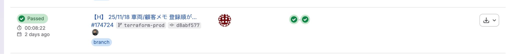
3. AWS Inspector -> 結果 -> コンテナイメージ別に移動します。
4. イメージタグprodをチェックし、脆弱性の数が以前のビルドから減少していることを確認します。
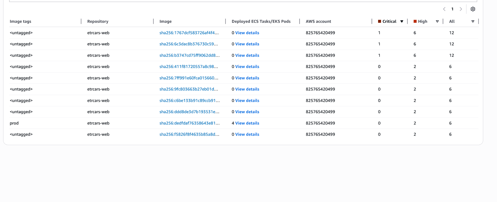
4. 上記の条件が満たされていない場合は、原因を調査し、デプロイパイプラインが成功しているかどうかを確認してください。必要に応じて、GitLabでデプロイを再試行してください。ECSコンソールで最新のタスクがデプロイされているかどうかを確認してください。
ステップ3
健康チェック
1. AWS開発者IAMアカウントにログインする
1. ステップ2が完了したら、ECSクラスタのステータスを確認します。
2. ECS -> クラスター -> etrcars-ecs-cluster -> サービスタブに移動します。
3. etrcars-django-service に3つのタスクが実行されていること、etrcars-rq-worker-service に1つのタスクが実行されていることを確認します。
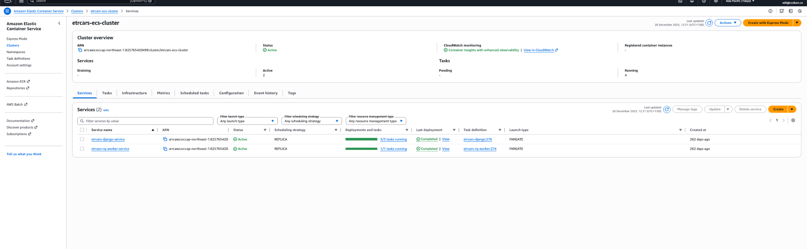
4. タスクタブでは、4つのタスクすべてが正常に実行されています。
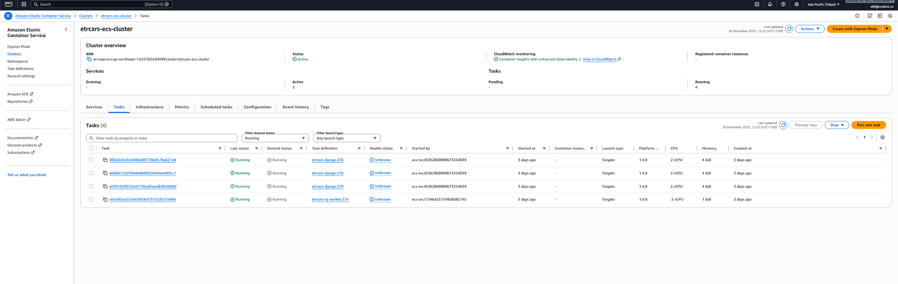
5. メトリックタブでCPUとメモリのメトリックが過負荷になっていないことを確認します
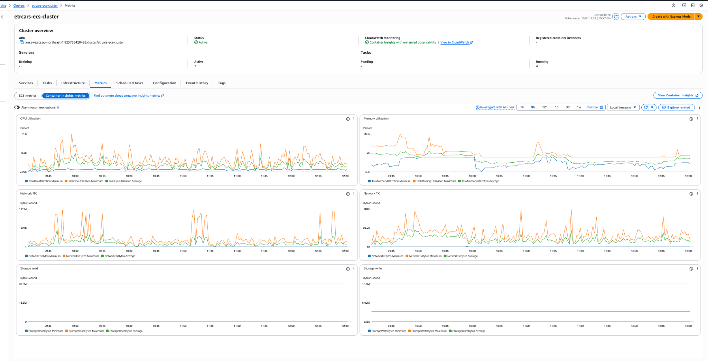
6. ログの下で、アプリケーション ログがまだ保存されており、エラーがないことを確認します。
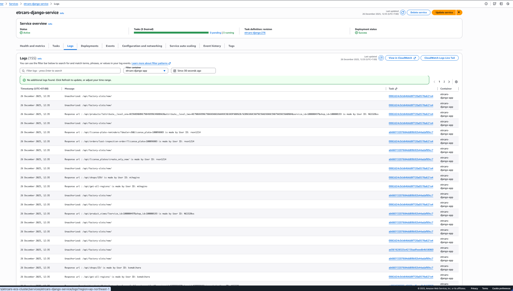
8. ヘルスチェックAPIを呼び出して、システムがまだ稼働していることを確認します。API 
URL:
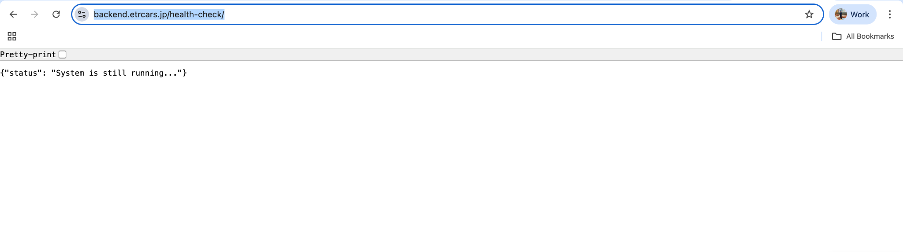
7. 上記の条件を満たしていない場合は、エラー箇所を調査してください。必要に応じて、GitLabから新しいビルドを再デプロイしてください。VPC、サブネット、セキュリティグループの設定が変更されていないことを確認してください。
ステップ4
接続テスト
1. AWS開発者IAMアカウントにログインする
2. EC2 -> ターゲットグループ -> etrcars-ecs-target-group に移動します。
3. ALB から ECS が正常に動作していることを確認するために、3 つのターゲットすべてが正常な状態であることを確認します。
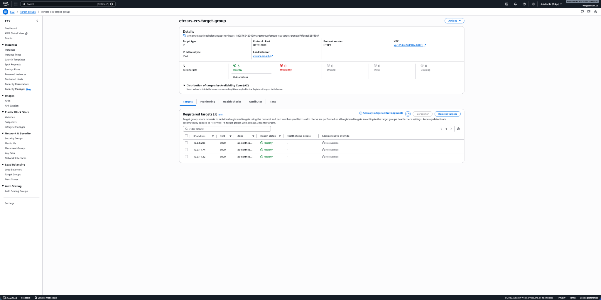
4. エラーが発生した場合は、手順を停止し、エラーの原因を調査し、必要に応じてパイプラインを再デプロイします。ALBとECSのネットワーク構成を確認してください。
5. ECS クラスター -> etrcars-ecs-cluster -> サービス -> etrcars-django-service -> ログに移動します。
6. ECS からデータベースへの接続が適切に機能していることを確認するために、最新のログにデータベース エラーに関するエラー ログがないことを確認します。
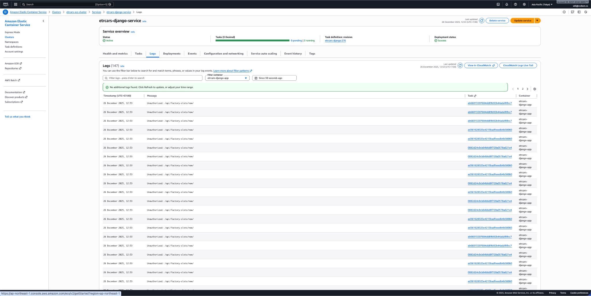
7. 外部API接続をテストする
API URL :
メソッド: GET
期待される応答: ステータス コード 200、JSON 応答
8. ステータスが200を返さない場合は、外部接続が正常に機能していません。その場合は原因を調査し、ECSセキュリティグループの送信ネットワーク設定とECS ACL送信ルール設定を確認してください。ETRBUYサーバー側で、ETRCARSからのリクエストが受信されていることを確認してください。
ステップ5
スモークテストアプリケーション
1. ウェブサイトを確認する
2. -> アカウントにログイン -> ホームページが表示されていることを確認します

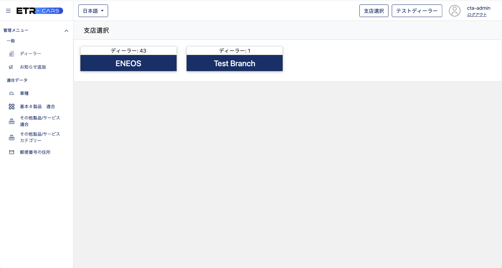
3. iPad (etrdemo100/etrdemo100)にログイン -> ログインが成功し、ホーム画面に移動できることを確認します

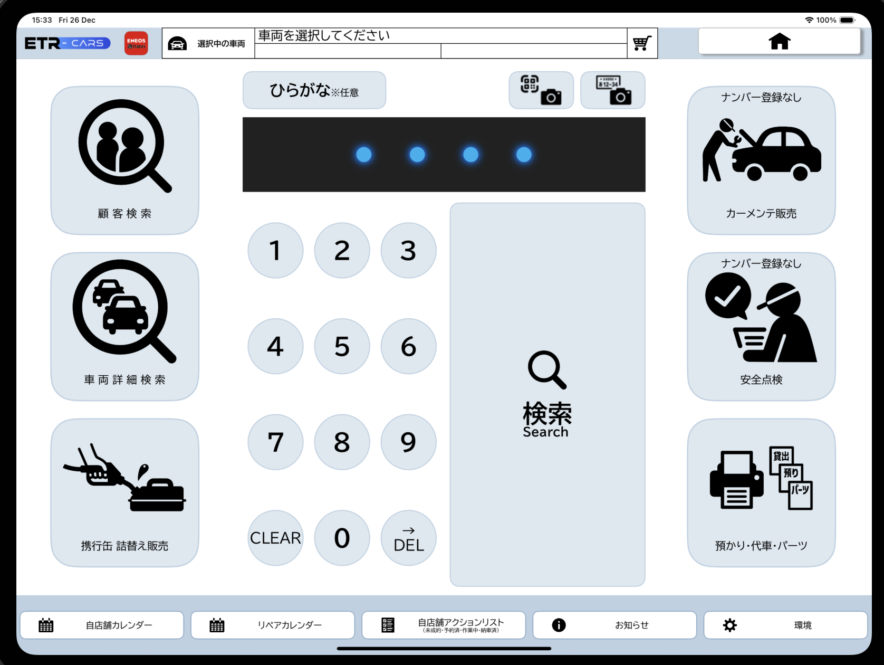
4. 車の検索機能をテストする
手順: ホーム画面 -> 車番号1231を検索 -> 結果が表示されていることを確認する

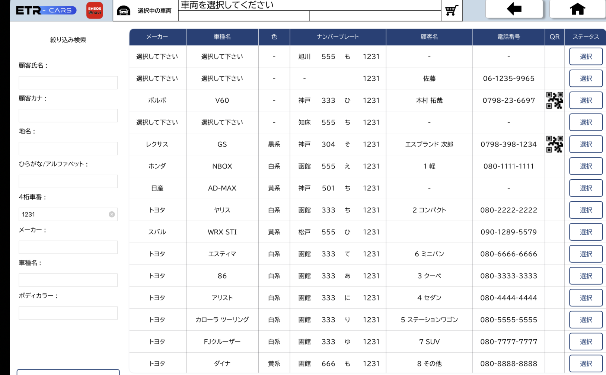
5.車の画像編集のテスト
手順：ホーム画面 -> 車番号1231を検索 -> 車を選択 -> ステータス画面 -> 車の編集 -> 新しい車の画像写真を撮る -> 保存 -> 正常に保存され、最新の画像が表示されていることを確認します。

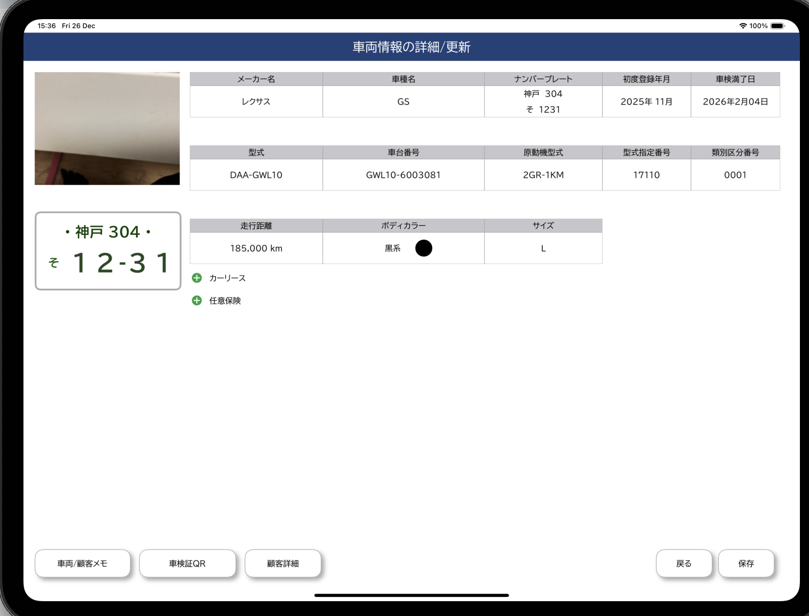
6. ナンバープレートのスキャン
手順: ホーム画面 -> ナンバープレートのスキャン -> スキャンが成功し、エラーがないことを確認し、結果ページに進みます。
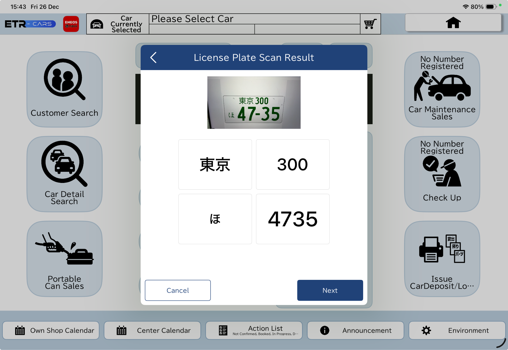
7. 注文作成
手順: ホーム -> 車のメンテナンス -> サービスを選択 -> 製品を選択 -> 注文概要画面 -> 作業納品ボタン -> 注文作成が成功したことを確認し、結果画面を表示します。
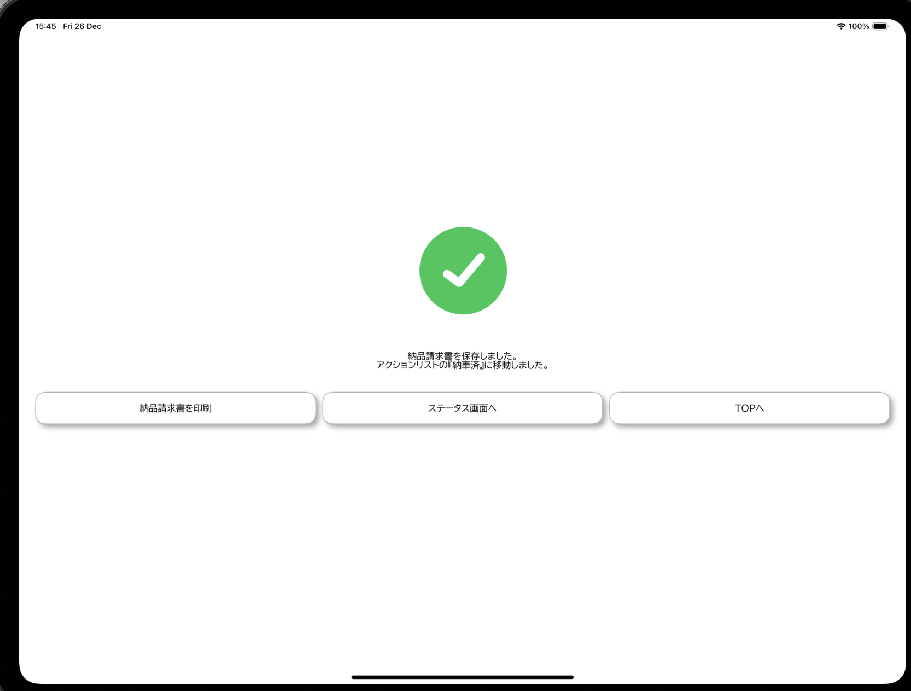
8. メール送信機能を確認する
手順：ホーム -> アクションリスト下部のボタン -> 任意の順序を選択 -> メール -> メールアドレスを入力 -> 送信 -> メールが正常に受信されていることを確認する
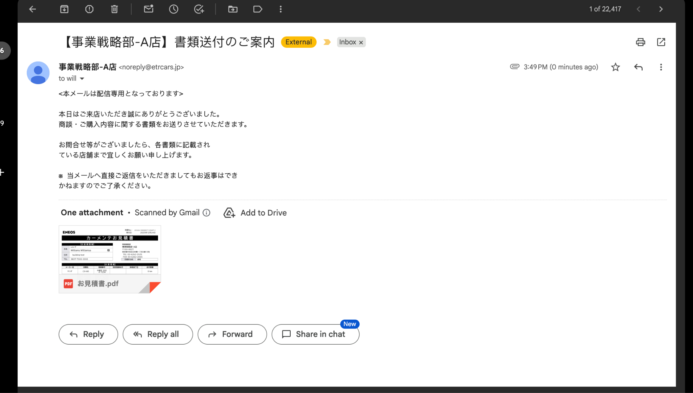
9. エクスポート機能の
手順: Webサイトにアクセス -> 注文モジュール -> 日付をフィルタリング -> エクスポート -> エクスポートモジュールでエクスポートが成功する

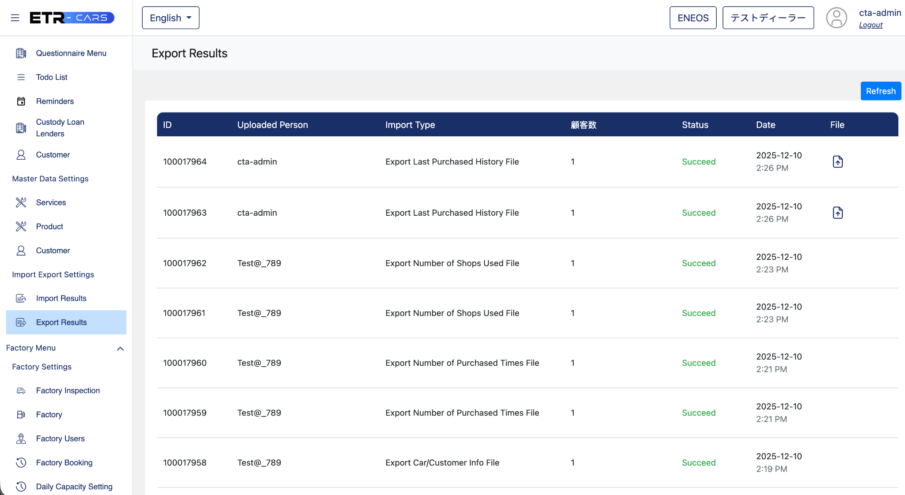
8. 上記の手順が機能しない場合は、テストを中止してください。ECS Clusters -> etrcars-ecs-cluster -> Services -> etrcars-django-service -> Logs のアプリケーションログでエラーを調査し、どのステップでエラーが発生しているかを調べてください。
ログインと車検索でエラーが発生している場合は、ログインAPIのエラーログを確認し、ID/PWが正しくないか、サーバーにアクセスできないかを確認してください。
車の画像編集と注文作成：S3 接続が機能していません。ECS セキュリティグループとサブネット ACL の送信ルールで S3 IP を確認してください。[VPC] -> [エンドポイント] で S3 の VPC エンドポイントを確認してください。ECS アプリケーション ログで潜在的なエラーを確認してください。
ナンバー プレート スキャン： Google API 接続が機能していません。ECS セキュリティグループとサブネット ACL の送信ルールで Google IP を確認してください。ECS アプリケーション ログで潜在的なエラーを確認してください。
メール送信：AWS SES 接続が機能していません。ECS セキュリティグループとサブネット ACL の送信ルールで SES IP を確認してください。ECS アプリケーション ログで潜在的なエラーを確認してください。SES ダッシュボードで、AWS -> Amazon SES -> アカウント ダッシュボードを調べて、潜在的な問題がないか確認してください。
エクスポート：エクスポートワーカーが動作していません。ECS -> サービス -> etrcars-rq-worker-service でワーカータスクが正常に実行されているか確認してください。ECS アプリケーションログで、エクスポートワーカーに関する潜在的なエラーを確認してください。