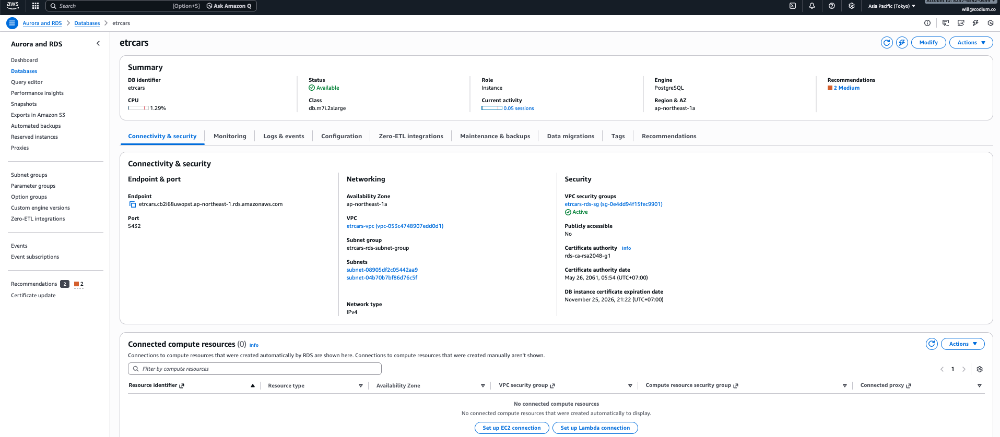
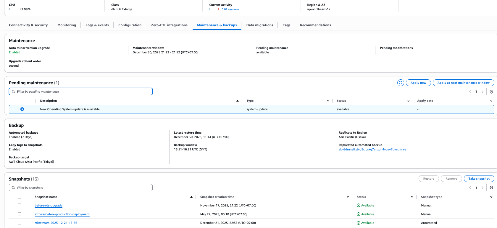
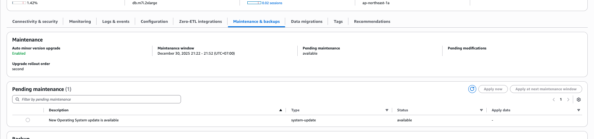
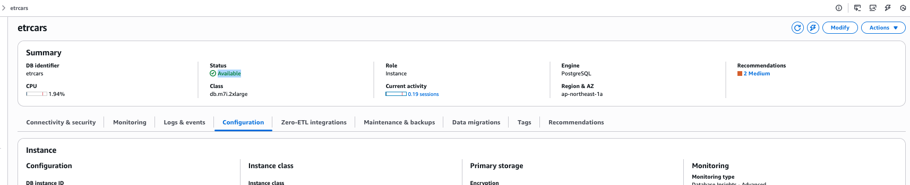
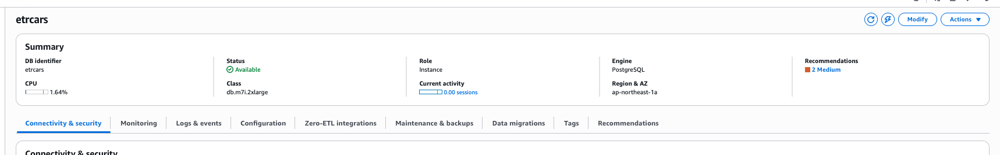
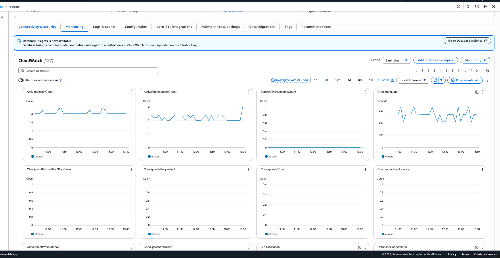
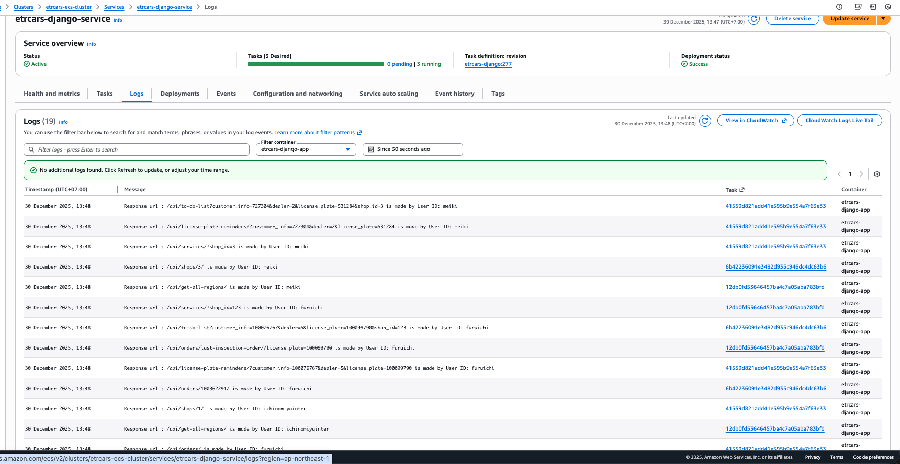
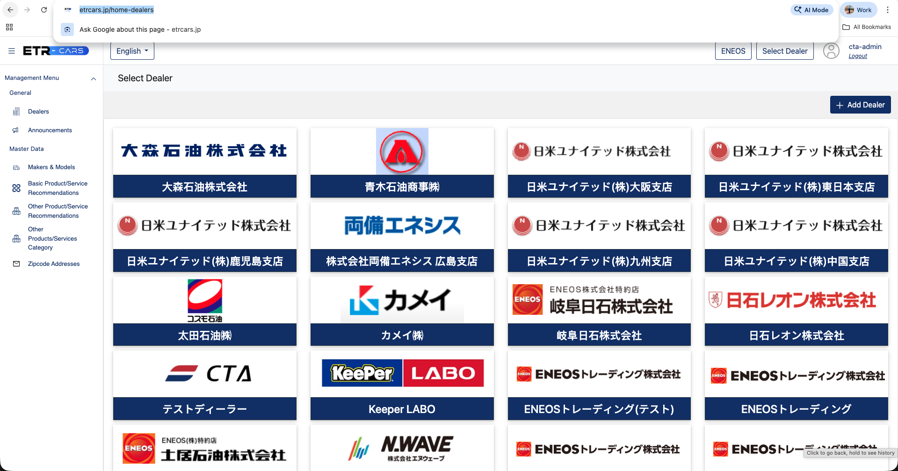

RDSパッチメンテナンス手順

ステップ1
パッチ適用
1. CODIUM PCを使用してCODIUM IPに接続します
2. AWS開発者IAMアカウントにログイン
3. AWS AuroraとRDS -> データベース -> etrcars

4. メンテナンスとバックアップタブに移動 ->保留中のメンテナンスセクションで利用可能なアップデートを確認します

保留中のメンテナンスのセクションで「今すぐ適用」をクリックします。
6. パッチ適用プロセスが完了するまで待ちます。
ステップ2
検証
1. AWS Aurora と RDS -> データベース -> etrcars
2. メンテナンスとバックアップタブに移動 ->保留中のメンテナンスセクション -> 更新する項目が残っていないことを確認します

3.概要タブで、 ステータスが利用可能であることを確認する

4. 上記の条件を満たしていない場合は、原因を調査し、 「ログとイベント」タブの「ログ」セクションでRDSログにエラーがないか確認してください。必要に応じてアップデートを再度適用してください。
ステップ3
健康チェック
1. ステップ2が完了したら、RDSインスタンスのステータスを確認します。
2. AWS AuroraとRDS -> データベース -> etrcars。ステータスが「available」になっていることを確認してください。

3. 監視タブで、CPU 負荷やその他のメトリックが過負荷になっていないことを確認します。

4. 上記の点が満たされていない場合は、手順を停止し、原因を調査し、必要に応じて RDS インスタンスを再起動します。
ステップ4
接続テスト
1. AWS開発者IAMアカウントにログインする
2. ECS クラスター -> etrcars-ecs-cluster -> サービス -> etrcars-django-service -> ログに移動します。
3. Django ログにデータベース接続エラーに関するログがないことを確認します。

4. エラーが発生した場合は、手順を停止し、エラーの原因を調査し、必要に応じてECSパイプラインを再デプロイします。ECSとRDSのネットワーク構成設定を確認し、必要に応じてRDSインスタンスを再起動します。
5. ウェブサイトでデータが表示されているか確認してください。ディーラーモジュール（ ）で、ディーラーリストが表示されるはずです。6 

. データが表示されない場合は、手順を中止し、エラーを調査し、必要に応じてECSパイプラインを再デプロイしてください。ECSとRDSのネットワーク構成を確認してください。必要に応じてRDSインスタンスを再起動してください。